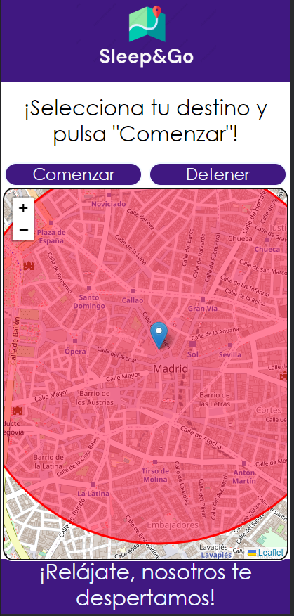
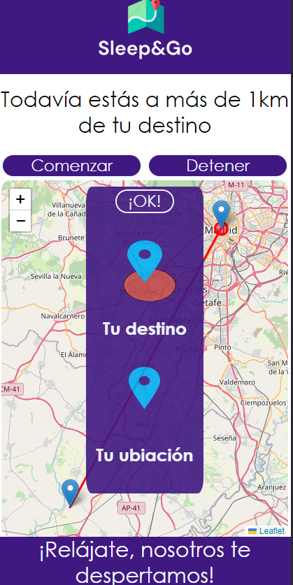
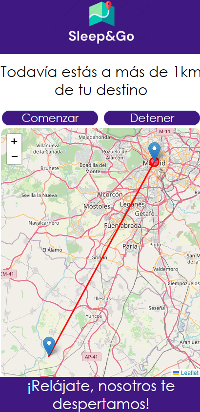

### Angel José Manch Núñez 

# Sleep&Go Description

Sleep&Go is an application that allows users to **fall asleep on public transport without worring about waking just on time for their stop**, since the app will be the one in charge of **waking them up through a vibration mode** when it detects that the traveller is **within a radius of one kilometer** around his or her destination.

To make use of the application, it is enough to select the desired destination by clicking directly on the map and then press the "start" button, which will start obtaining the location in real time of the user. At all times on the map there will be two markers, one that represents the user's real-time location and another static marker which has a one kilometer circle around it to simulate the destination. Both markers are joined by a straight line and as the user gets closer to the destination, the location marker will also get closer until it enters the radius of the destination, which will cause an alert to appear on the screen and the mobile device will start to vibrate.

The "stop" button stops real-time location acquisition and removes markers from the map

# Demo
- Select destination:

- The markers that represents the user and destination´s coordinates:

- Whenever the user enters the 1km radius surrounding the destination, the mobile phone will start to vibrate:

# Code Description:

Regarding the implementation of the mentioned functionalities in javascript, it has been divided mainly into two functions. The first one, "marker()", is responsible for capturing the user's "click" event on the map to give coordinates to the marker that will represent the user's destination. The "vibrate()" function is responsible for updating at all times the coordinates of the marker that represents the user's real-time location through the "watchPosition()" method of the Leaflet service to obtain the coordinates when a change occurs at the location. In this way, and through the "dentro_radio()" function, as soon as the user's coordinates are contained in the radius of one kilometer that surrounds the destination marker, a modal window will be displayed and "navigator.vibrate" will be used to vibrate the mobile device while it does not leave the radio.
